<!-- Centrar la imagen -->
<p align="center">
  

# Universidad Católica del Uruguay

## Facultad de Ingeniería y Tecnologías

### Desarrollo de Software Seguro

#### Unidad Temática 2: Trabajo Obligatorio

Mitigación de Vulnerabilidades de CWE

<br/>
<br/>

#### Integrantes:

Enzo Barreto

Guillermo Rivero

</center>
<br/>
<br/>

# Consigna

Para cada una de las siguientes vulnerabilidades completar la siguiente tabla con:
- Generar una prueba de concepto de la vulnerabilidad: explicar paso a paso cómo llegar a la vulnerabilidad y qué datos ingresar para explotarla.
- Implementar la mitigación: Realizar modificaciones en el código fuente de forma que se elimine la vulnerabilidad.

## Vulnerabilidad 1 - Cross Site Scripting

> Existe un crosssite scripting (XSS) en el parámetro queryde la urlsearch.jsp
> 
> Demostrar la existencia de la vulnerabilidad y mitigarla.

Verificando la existencia de la vulnerabilidad:

<center>

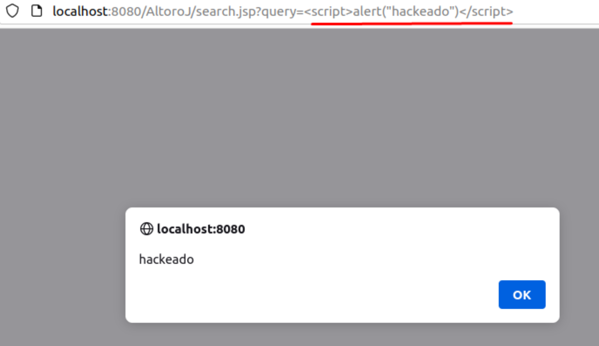

</center>
Para mitigar la vulnerabilidad, se debe escapar el contenido de la variable `query` en el archivo `search.jsp`:
  
Se agrego el método `sanitizeHtmlWith` para escapar el contenido de la variable `query` lo que permite mitigar la vulnerabilidad, no permitiendo que se ejecute el script, como se puede ver en la siguiente imagen:
<center>

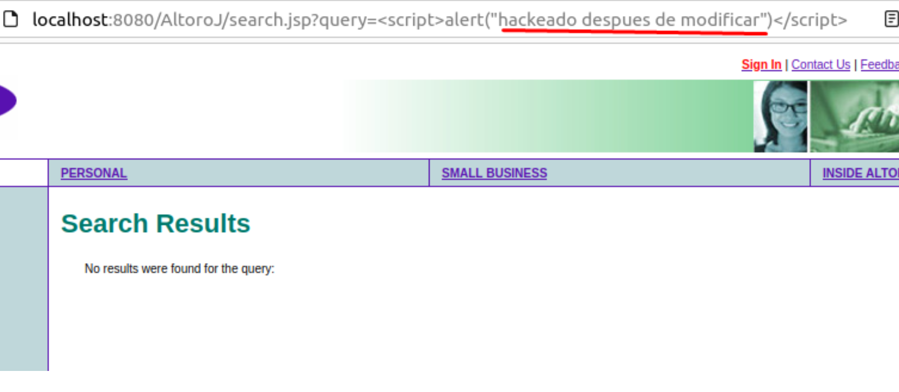

</center>

La siguiente imagen muestra el código modificado, como se menciona anteriormente, se agrego el método `sanitizeHtmlWith` para escapar el contenido de la variable `query`, apreciandose en la línea 35 del archivo `search.jsp`:
<center>

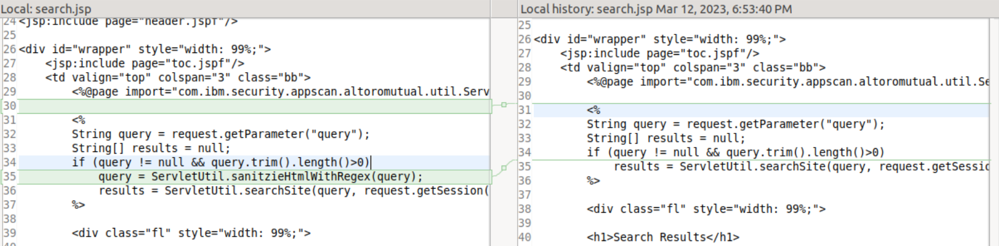

</center>
</br>

## Vulnerabilidad 2 - SQL Injection

> Existe una Inyección SQL en el login.
>
> Demostrar la existencia de la vulnerabilidad y mitigarla.

La vulnerabilidad de Inyección SQL es una vulnerabilidad que permite a un atacante ejecutar código SQL arbitrario en la base de datos. Esto puede permitir al atacante leer datos sensibles de la base de datos, modificar datos de la base de datos, ejecutar operaciones de administración en la base de datos, recuperar el contenido del sistema de archivos y, en algunos casos, ejecutar comandos en el sistema operativo subyacente.

Verificando la existencia de la vulnerabilidad:

<center>

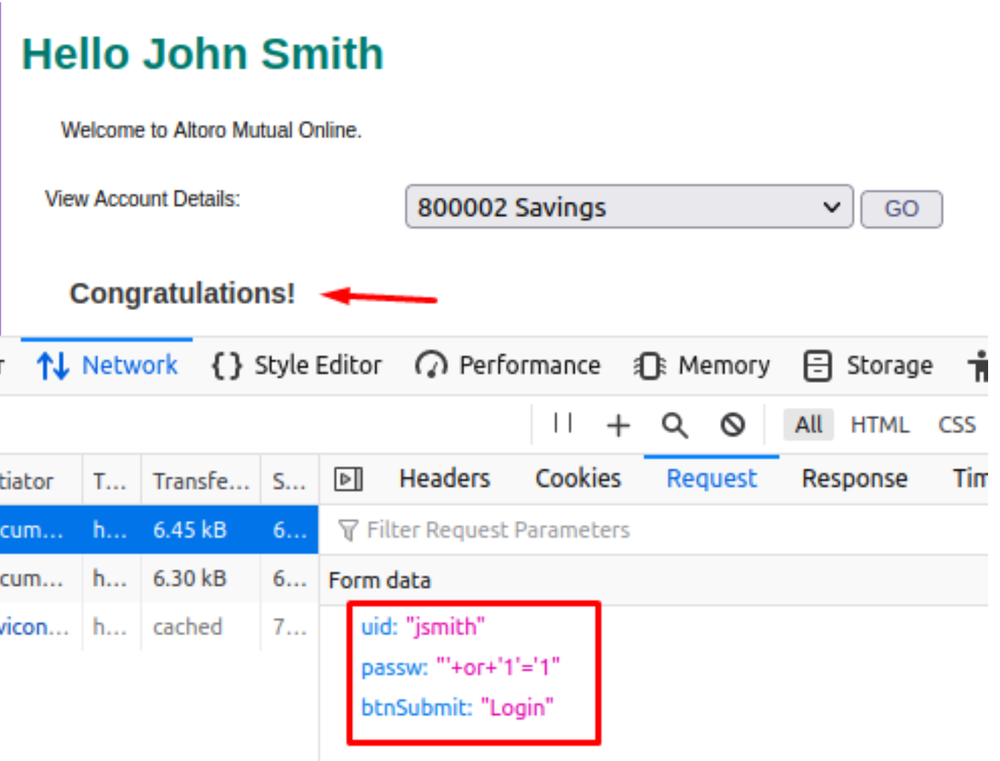

</center>

Como se aprecia en la imagen anterior, al ingresar un usuario válido y en la contraseña ingresar código SQL, `' or '1'='1`, se puede acceder a la cuenta de ese usuario, sin necesidad de conocer la contraseña.

La evidencia se muestra en la pestaña `network` al inspeccionar el navegador, al intentar ingresar se envía una petición `POST` con los datos del usuario y la contraseña, tal como figura en la parte inferior de la anterior imagen.

Para mitigar la vulnerabilidad, se debe escapar el contenido de la variable `password` en el archivo `login.jsp`:

```jsp
String password = request.getParameter("password");
```

En este caso se utiliza una clase existente en el proyecto, `StringEscapeUtils`, que permite escapar el contenido de la variable `password` y mitigar la vulnerabilidad, no permitiendo que se ejecute el script, como se puede ver en la siguiente imagen:

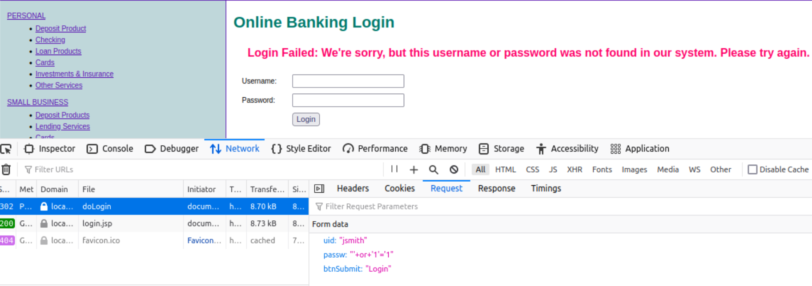

La siguiente imagen muestra el código modificado, como se menciona anteriormente, se agrego el método `escapeSql` para escapar el contenido de la variable `password`, apreciandose en las lineas 88 a 90 del archivo `LoginServlet.java`:

<center>

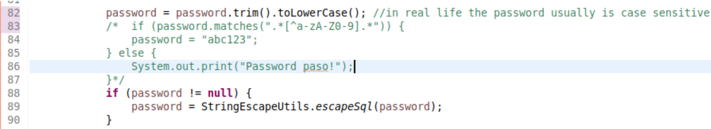

</center>

</br>

## Vulnerabilidad 3 - Improper Input Validation

> Como un usuario autenticado, generar un error producto de un tipo de dato inválido.
> 
> Usuario: jsmith/ demo1234
> 
> Demostrar la existencia de la vulnerabilidad y mitigarla.

En este caso, lo que se muestra es como modificando el dato en la parte de la URL, se puede acceder a una cuenta que no es la del usuario que se ingreso en el login, pudiento acceder a información que no debería ser accesible para el usuario que se ingreso en el login.

<center>

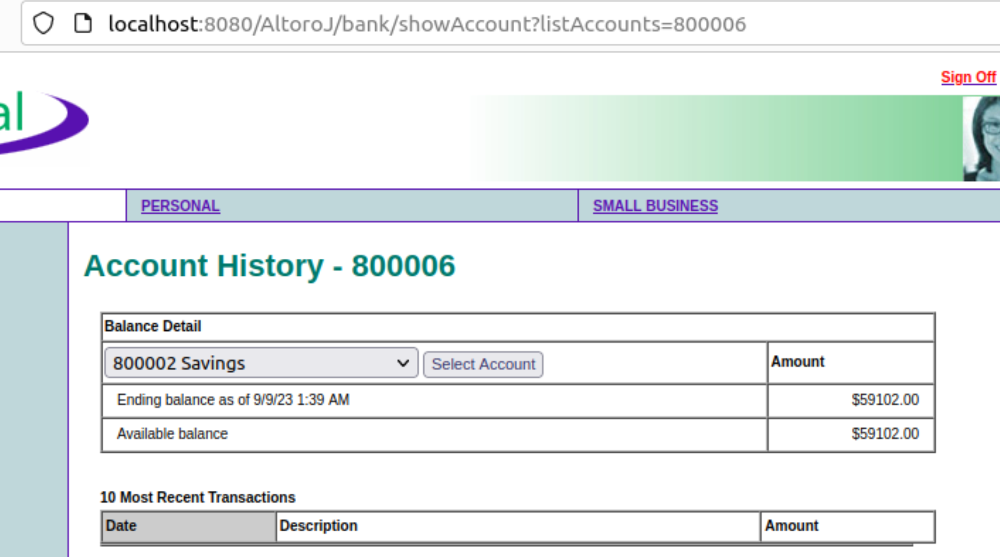

</center>

<!-- Como se puede ver en la imagen anterior, el usuario jSmith puede acceder a información de otra cuenta como lo es la `800006` de la que no es propietario, este tipo de cosas se debe evitar, ya que el usuario no debería poder acceder a información que no es de su propiedad.

Para solucionar este problema, se debe validar que el usuario que se ingresa en la URL sea el mismo que el que se ingreso en el login, para esto se debe modificar el archivo `AccountViewServlet.java` en la linea 42, agregando la siguiente validación:
  
  ```java
  if (account.getCustomerId() != customer.getId()) {
    response.sendRedirect("accounts.jsp");
    return;
  }
  ``` -->

</br>

## Vulnerabilidad 4 - OS Command Injection

> Existe una inyección de comando en el parámetro content de la página index.jsp.
> 
> Demostrar la existencia de la vulnerabilidad y mitigarla


</br>

## Vulnerabilidad 5 - Path Traversal

> Existe una vulnerabilidad de Path Traversal en el parámetro file de la página upload.jsp.
>
> Demostrar la existencia de la vulnerabilidad y mitigarla.

</br>

## Vulnerabilidad 6 - Use of Hard-coded Credentials

> En la interfaz de administración (/AltoroJ/admin/login.jsp) se utiliza una clave codificada directamente en el código fuente.
> 
> Identificarla y quitarla del código, asegurándose que la funcionalidad no se vea afectada.

Este tipo de vulnerabilidad se da cuando se utilizan credenciales codificadas en el código fuente, lo que permite que un atacante pueda acceder a la cuenta de administrador, ya que conoce la contraseña.

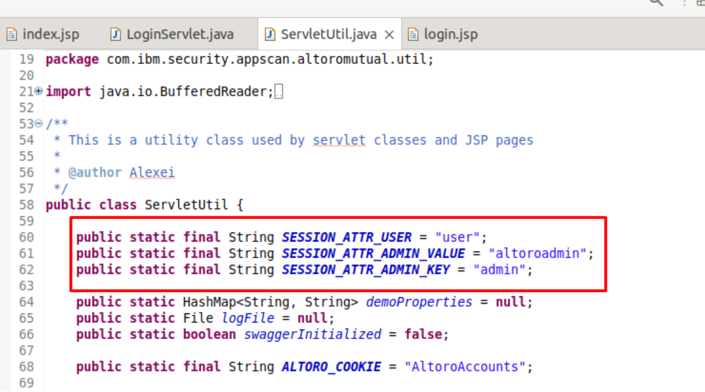

Como se puede ver en la imagen anterior, la contraseña del administrador se encuentra implicita en el código fuente, lo que permite que un atacante pueda acceder a la cuenta de administrador, ya que conoce la contraseña.

La misma se encuentra en el archivo `ServletUtils.java` en la linea 60 a 62 y no se encuentra encriptada, por lo que se puede ver la contraseña en texto plano. O bien en un archivo de propiedades, como debería ser.

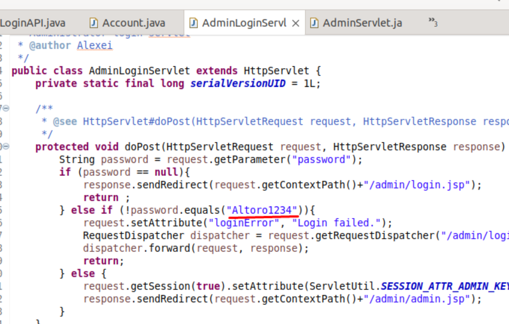

La verificación de contraseña planteada ahí, es la que debe realizarse con el archivo de propiedades, para que no se pueda ver la contraseña en texto plano. De lo contrario accediendo a la url `localhost:8080/AltoroJ/admin/login.jsp` se puede ingresar a la cuenta administrador:

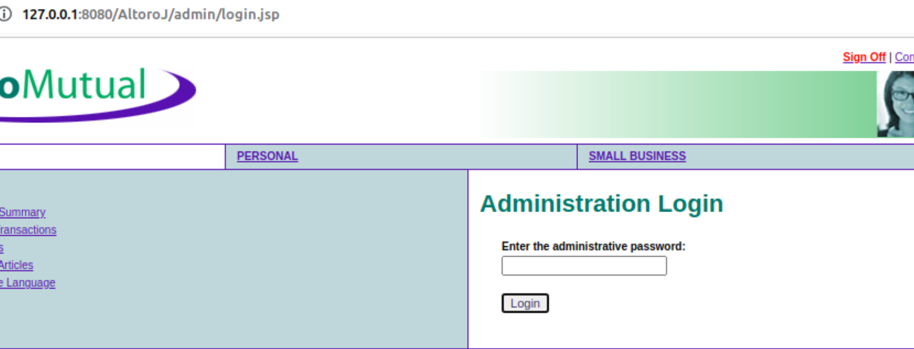

Para solucionar este problema, se debe modificar el archivo `AdminLoginServlet.java` y agregar la configuracion en el archivo `app.properties`:

```java
protected void doPost(HttpServletRequest request, HttpServletResponse response) throws ServletException, IOException {

  Properties prop = new Properties(); //Se crea un objeto de tipo Properties
  // Se valida en el archivo app.properties si existe la contraseña del administrador
  try {
    InputStream input = getServletContext().getResourceAsStream("/WEB-INF/app.properties");
    if (input != null) {
      prop.load(input); // Se carga el archivo app.properties
    } else {
      throw new IOException("Error al cargar Properties");
    }
  } catch (IOException e) {
    throw new ServletException("Error al cargar Properties",e);
  }
  // Se obtiene la contraseña del administrador del archivo app.properties
  String passwdProp = prop.getProperty("ADMIN_PASSWORD");
  
  if (passwdProp == null) { // Si no existe la contraseña del administrador en el archivo app.properties
    response.sendRedirect(request.getContextPath() + "/admin/login.jsp");
    return;
  }
  
  String password = request.getParameter("password"); // Se obtiene la contraseña ingresada en el login

  if (password == null) {
    response.sendRedirect(request.getContextPath()+"/admin/login.jsp");
    return ;
  } else  if (!password.equals(passwdProp)){ // Se modifico la condición que anteriormente decia "if (!password.equals("Altoro1234"))"
    request.setAttribute("loginError", "Login failed.");
    RequestDispatcher dispatcher = request.getRequestDispatcher("/admin/login.jsp");
    dispatcher.forward(request, response);
    return;
  } else {
    request.getSession(true).setAttribute(ServletUtil.SESSION_ATTR_ADMIN_KEY, ServletUtil.SESSION_ATTR_ADMIN_VALUE); // Se agrega el atributo de sesión
    response.sendRedirect(request.getContextPath()+"/admin/admin.jsp");
  }
}
```

El archivo `app.properties` se encuentra en la carpeta `WEB-INF` y contiene la contraseña del administrador:

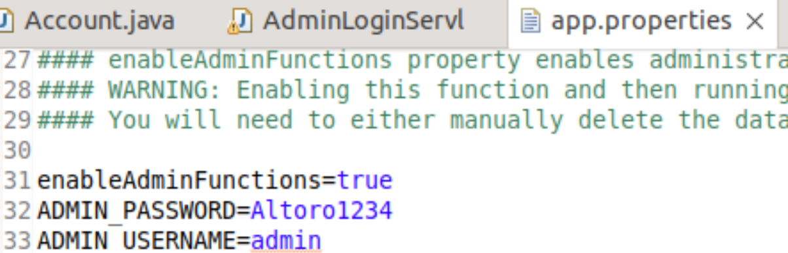

</br>

## Vulnerabilidad 7 - MissingAuthorization

> Como un usuario autenticado, visualizar la historia de una cuentaquenocorrespondaalusuario
> 
> Usuario: jsmith/ demo1234
> 
> Demostrar la existencia de la vulnerabilidad y mitigarla.

Esta vulnerabilidad se da cuando un usuario puede acceder a información que no es de su propiedad, en este caso, el usuario `jsmith` puede acceder a la información de la cuenta `800006` que no es de su propiedad.

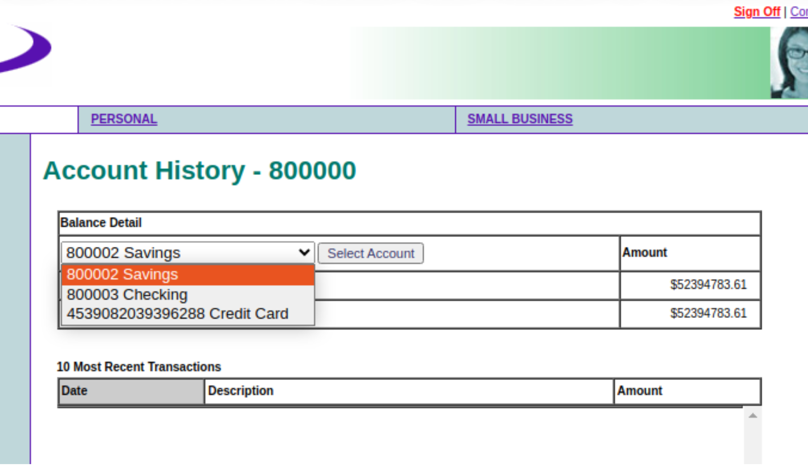

Para solucionar este problema, se debe modificar el archivo `AccountViewServlet.java` haciendo que la cuenta, que se obtiene de `AccountAPI.java` y accediendo a su método `getAccounts`, que devolverá las cuentas del usuario:


## Vulnerabilidad 8 - Missing Authentication for Critical Function

> Existe un API que permite conocer el saldo de la cuenta 
> Usuario: jsmith/ demo1234
> Demostrar la existencia de la vulnerabilidad (realizando un pedido a la API) y mitigar la vulnerabilidad.

En este caso lo que realizamos fue probar la existencia de la vulnerabilidad y para eso como primer paso nos logeamos con el Ususario de jsmith. Luego de eso obtuvimos las cookies como se pueden apreciar en la imagen: 

<center>

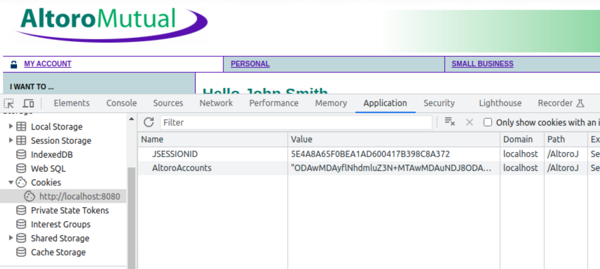

</center>

Luego de eso probamos en el Swagger Ui el Get/ account/accountNo. Ingresamos la Authorization que obtuvimos anteriormente y especificamos el número de cuenta al cual queremos acceder: 


<center>

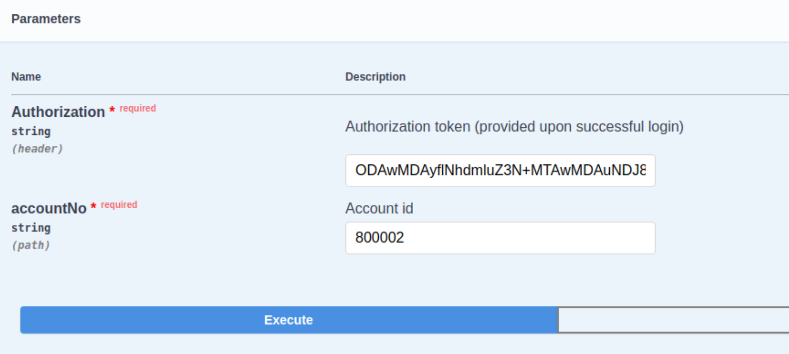

</center>

El resultado que nos da es que no estmos autorizados, que debemos logearnos primero: 

<center>

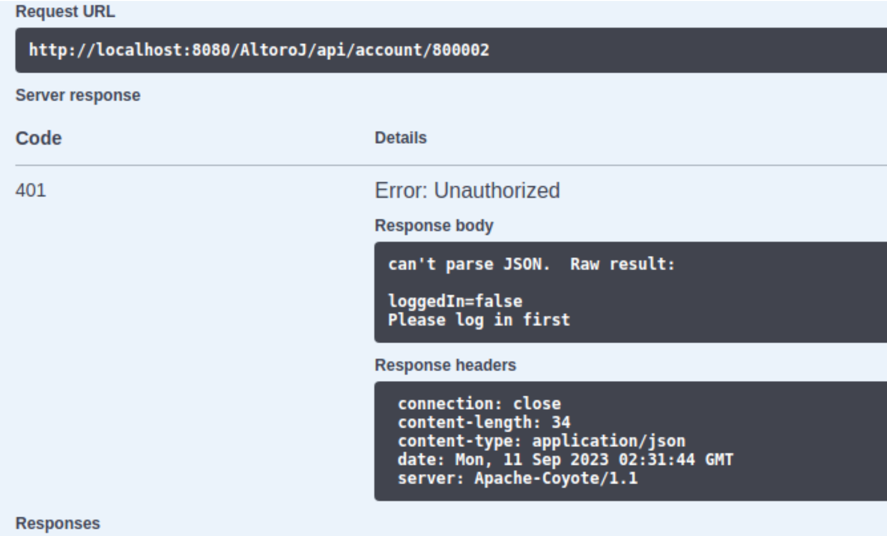

</center>

Por lo cual podemos concluir que la vulnerabilidad no existe, ya que habiendo hecho una solicitud a la API la misma no nos devuolvió los datos de la cuenta ya que no estabamos logeados. 